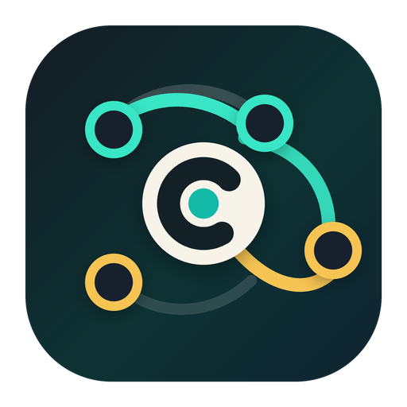

# Codex Conductor

<p align="center">
  
</p>

Codex Conductor is a small orchestration layer for Codex. It packages a CLI,
a Codex skill, and a prompt hook as a local Codex plugin so one Codex thread
can coordinate visible subagents and project-scoped worker threads.

[中文说明](./README.zh-CN.md)

## Ask Codex To Install It

Paste this prompt into Codex:

```text
Install Codex Conductor from https://github.com/ZhouhaoJiang/codex-conductor. Add it as a Codex plugin marketplace, install codex-conductor@codex-conductor, and link the optional CLI.
```

Codex can run the native plugin install flow for you. Approve the shell
commands and plugin trust prompt when Codex asks.

## Status

Codex Conductor is experimental and currently published as a `0.1.x` local
plugin. The CLI and plugin install path are usable, but the Codex plugin
manifest and hook APIs may still change.

## What It Does

- Registers and switches named local projects from the terminal.
- Opens or runs Codex CLI commands in the active project.
- Generates dispatch prompts for Codex App coordinator threads.
- Installs focused Codex skills for coordination, dispatch, project routing,
  and execution result collection.
- Installs a conservative `UserPromptSubmit` hook that suggests Conductor when
  a prompt looks like multi-agent, multi-thread, multi-session, project, or worker
  orchestration work.

Conductor does not run an MCP server. V1 intentionally uses Codex App's native
thread tools for durable App-side thread orchestration while keeping the
dispatch protocol independent of any specific subagent implementation.

## Visible Dispatch Model

Conductor keeps the current Codex thread as the coordinator. The coordinator
makes orchestration visible no matter which execution capability it uses:

1. Show a `Dispatch Plan` before creating or messaging execution units.
2. Dispatch visible subagents, worker threads, or collector units for meaningful
   work units.
3. Give every nested dispatch its own visible plan and fan-out budget.
4. Collect child results and synthesize the final answer in the coordinator
   thread.

Visible subagents and worker threads are the execution artifacts. Conductor does
not create a hidden session-operator just to perform thread API calls. A
collector can be dispatched as a visible unit when result collection is
substantial, but the coordinator remains responsible for the final synthesis.

## Requirements

- macOS or Linux shell environment
- Codex CLI installed and authenticated, with plugin install commands available
- Node.js on `PATH` for the prompt hook

## Install

### Native Codex Install

Install the marketplace with Codex's native plugin commands:

```bash
codex plugin marketplace add ZhouhaoJiang/codex-conductor
codex plugin add codex-conductor@codex-conductor
```

For a local clone, use the clone path as the marketplace root:

```bash
git clone https://github.com/ZhouhaoJiang/codex-conductor.git
cd codex-conductor
codex plugin marketplace add "$PWD"
codex plugin add codex-conductor@codex-conductor
```

Then link the optional CLI:

```bash
mkdir -p ~/.local/bin
ln -sf "$PWD/plugins/codex-conductor/bin/codex-conductor" ~/.local/bin/codex-conductor
```

Open `/plugins` in Codex App if you prefer to install from the plugin UI after
adding the marketplace.

### Convenience Installer

`./install.sh` wraps the native commands above and also links the CLI:

```bash
./install.sh
```

The installer:

1. Registers this repo as the `codex-conductor` Codex plugin marketplace.
2. Installs `codex-conductor@codex-conductor`, including the bundled skill and prompt hook.
3. Links the CLI to `~/.local/bin/codex-conductor` by default.

The installer automatically looks for a Codex CLI binary that supports
`codex plugin add`. If an older `codex` appears first on `PATH`, point the
installer at a newer binary:

```bash
CODEX_BIN=/Applications/Codex.app/Contents/Resources/codex ./install.sh
```

Use a different CLI directory:

```bash
./install.sh --cli-dir /usr/local/bin
```

Skip CLI linking:

```bash
./install.sh --no-cli
```

Preview the commands without changing anything:

```bash
./install.sh --dry-run
```

`--dry-run` is a verification tool, not an installation step.

After installation, start a new Codex thread so Codex loads the new skill and
hook.

## Upgrade

Git marketplaces are installed from snapshots. A GitHub marketplace source does
not live-sync an already installed plugin after this repo changes.

To upgrade later:

```bash
codex plugin marketplace upgrade codex-conductor
codex plugin add codex-conductor@codex-conductor
```

If you are not sure which marketplaces are configured:

```bash
codex plugin marketplace list
codex plugin marketplace upgrade
codex plugin add codex-conductor@codex-conductor
```

Start a new Codex thread after upgrading so Codex reloads the updated skills and
hooks.

## CLI Quick Start

```bash
codex-conductor project add app ~/projects/my-app
codex-conductor project use app
codex-conductor project list
codex-conductor dispatch "split this into db, backend, and ui workers"
```

Useful commands:

```bash
codex-conductor project add <name> <absolute-path> [profile]
codex-conductor project use <name>
codex-conductor project current
codex-conductor project list
codex-conductor project path [name]
codex-conductor open [name] [prompt...]
codex-conductor exec [name] <prompt...>
codex-conductor resume <thread-id-or-name> [prompt...]
codex-conductor fork <thread-id-or-name> [prompt...]
codex-conductor dispatch [name] <goal...>
```

Set `CODEX_CONDUCTOR_HOME` to store CLI state somewhere other than
`~/.codex-conductor`.

## Codex App Usage

In a new Codex App thread, try:

```text
Use Codex Conductor to split this task into visible workers.
```

The installed skill guides the coordinator thread to:

- find or target a project
- show a concise dispatch plan before creating execution units
- dispatch visible subagents, worker threads, or collector units
- assign narrow worker roles and fan-out budgets
- set readable thread titles
- collect child results
- synthesize the final result in the coordinator thread

The prompt hook only injects a recommendation. It does not create threads by
itself.

Shortcut prompts also trigger the hook when they start with `CCC`, `/ccc`,
`codex conductor`, `codex-conductor`, `codex con`, or `conductor`.

## Repository Layout

```text
.agents/plugins/marketplace.json
plugins/codex-conductor/
  .codex-plugin/plugin.json
  assets/icon.png
  assets/logo.png
  assets/logo-dark.png
  assets/logo.svg
  bin/codex-conductor
  hooks/user-prompt-submit-recommending-conductor.json
  scripts/conductor-hook.mjs
  scripts/smoke-test
  skills/conductor/SKILL.md
  skills/conductor-dispatch/SKILL.md
  skills/conductor-projects/SKILL.md
  skills/conductor-collector/SKILL.md
```

## Development Verification

These commands are for contributors validating a local checkout. They are not
the user install path.

Run:

```bash
plugins/codex-conductor/scripts/smoke-test
node --check plugins/codex-conductor/scripts/conductor-hook.mjs
python3 -m json.tool plugins/codex-conductor/.codex-plugin/plugin.json >/dev/null
python3 -m json.tool plugins/codex-conductor/hooks/user-prompt-submit-recommending-conductor.json >/dev/null
bash -n install.sh plugins/codex-conductor/bin/codex-conductor plugins/codex-conductor/scripts/smoke-test
./install.sh --dry-run
codex plugin add codex-conductor@codex-conductor --json
```

## Contributing And Security

See [CONTRIBUTING.md](./CONTRIBUTING.md), [SECURITY.md](./SECURITY.md), and
[CHANGELOG.md](./CHANGELOG.md).

## License

MIT
